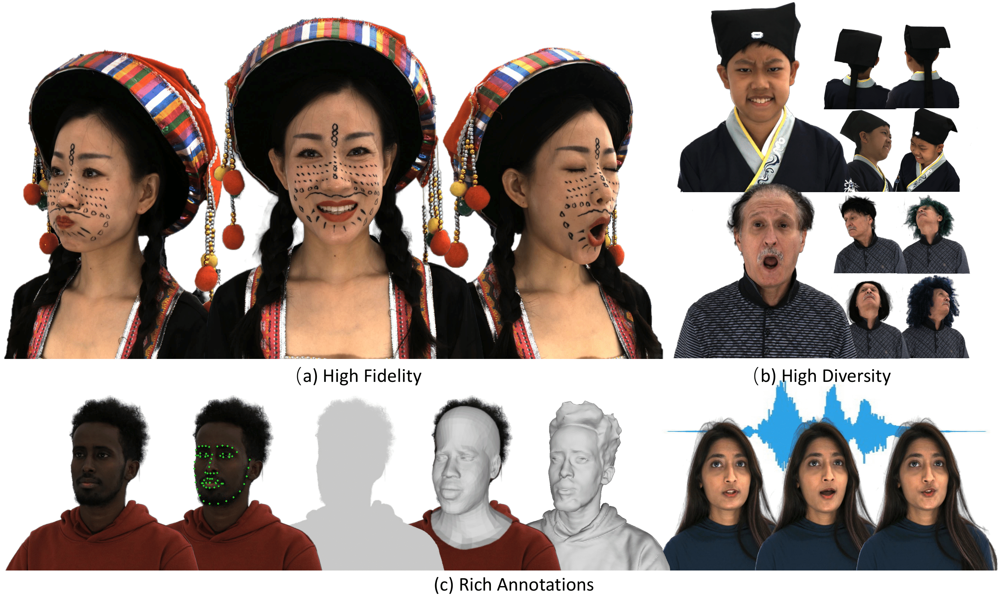

# RenderMe-360 Dataset
[](https://arxiv.org/abs/2305.13353) <a href="https://renderme-360.github.io/">
</a> 
<a href="https://youtu.be/L4YTBVg68vM"></a> 

This is the Benchmark PyTorch implementation of the paper *"[RenderMe-360: A Large Digital Asset Library and Benchmarks Towards High-fidelity Head Avatars]()"*.



<!---->

https://github.com/RenderMe-360/RenderMe-360/assets/132734896/0daa921a-93c7-4ddc-9b73-0f2974cbb523

> 
>
> **Abstract:** *Synthesizing high-fidelity head avatars is a central problem for many applications on AR, VR, and Metaverse. While head avatar synthesis algorithms have advanced rapidly, the best ones still face great obstacles in real-world scenarios. One of the vital causes is the inadequate datasets  -- 1) current public datasets can only support researchers to explore high-fidelity head avatars in one or two task directions, such as viewpoint, head pose, hairstyle, or facial expression; 2) these datasets usually contain digital head assets with limited data volume, and narrow distribution over different attributes, such as expressions, ages, and accessories. In this paper, we present *RenderMe-360*, a comprehensive 4D human head dataset to drive advance in head avatar algorithms across different scenarios. RenderMe-360 contains massive data assets, with 250+ million complete head frames and over 800k video sequences from 500 different identities captured by synchronized HD multi-view cameras at 30 fps. It is a large-scale digital library for head avatars with three key attributes: 1) High Fidelity: all subjects are captured by 60 synchronized, high-resolution 2K cameras to collect their portrait data in 360 degrees. 2) High Diversity: The collected subjects vary from different ages, eras, ethnicity, and cultures, providing abundant materials with distinctive styles in appearance and geometry. Moreover, each subject is asked to perform various dynamic motions, such as expressions and head rotations, which further extend the richness of assets. 3) Rich Annotations: the dataset provides annotations with different granularities: cameras' parameters, background matting, scan, 2D as well as 3D facial landmarks, FLAME fitting labeled by semi-auto annotation, and text description. Based on the dataset, we build a comprehensive benchmark for head avatar research, with 16 state-of-the-art methods performed on five main tasks: novel view synthesis, novel expression synthesis, hair rendering, hair editing, and talking head generation. Our experiments uncover the strengths and weaknesses of state-of-the-art methods, showing that extra efforts are needed for them to perform in such diverse scenarios. RenderMe-360 opens the door for future exploration in modern head avatars. All of the data, code, and models will be publicly available at https://renderme-360.github.io/.* <br>

## Updates
- 2024.05.01: Please refer to [RenderMe-360 Benchmark](https://github.com/RenderMe-360/RenderMe-360-Benchmark) to check our released benchmark code, training data and model!!
- 2023.09.22: 🎉 Our paper has been accepted by NeurIPS 2023 D&B Track.
- 2023.09.21: :fire::fire::fire:**Data of 21 subjects have been released! [Download Link](https://renderme-360.github.io/inner-download.html#Download)**:fire::fire::fire:
- 2023.05.24: Data and code will be released around September. Please stay tuned!
- 2023.05.24: :fire::fire::fire:**The [technical report](https://arxiv.org/abs/2305.13353) is released!**:fire::fire::fire:
- 2023.05.10: The [demo video](https://www.youtube.com/watch?v=L4YTBVg68vM) is uploaded.
- 2023.05.08: The [project page](https://renderme-360.github.io/) is created.


## Contents
1. [Features](#features)
2. [Data Download](#Data-Download)
3. [Benchmark & Model Zoo](#Benchmark-&-Model-Zoo)
4. [Usage](#Usage)
5. [Related Works](#Related-Works)
6. [Citation](#citation)
6. [Acknowlegement](#Acknowlegement)


# Features
*  High Fidelity: Build a multi-video camera capture cylinder called POLICY to capture synchronized multi-view videos. 60 instructive cameras / 2448 × 2048 / 30FPS for video capture. 
* High Diversity: RenderMe-360 is a large-scale dataset with 500 IDs and 243M frames in total, far exceeds other datasets. A wide diversity including era, ethnicity, accessory and makeup. Each subject capture about 20-30 performance parts including expression, hair, and speech.
* Rich Annotations: Rich and multimodal annotation far beyond other datasets: face landmark 2d & 3d, front-back matting, FLAME parameters, scan mesh, uv map, action units, appearance annotation and text description. 
## Data Download
✨ We have released raw data and annotations of 21 subjects! Please refer to [RenderMe-360 Download](https://opendatalab.com/OpenXDLab/RenderMe-360).🎉🎉

## Benchmark & Model Zoo

We provide for each benchmark the pretrained model, code for training & evaluation reimplementation, and dataset for training. Refer to [RenderMe-360-Benchmark](https://github.com/RenderMe-360/RenderMe-360-Benchmark).

## Usage
The code will be released around September!

## TODO List

- [x] Release Code and pretrained model
- [ ] Release Dataset
- [x] Technical Report
- [x] Project page


## Related Works
* (ICCV 2023) **DNA-Rendering: A Diverse Neural Actor Repository for High-Fidelity Human-centric Rendering**, DNA-Rendering Team. [[Paper](https://arxiv.org/abs/2307.10173)], [[Project Page](https://dna-rendering.github.io/index.html#hero)]
## Citation

```bibtex
@article{pan2024renderme,
      title={RenderMe-360: A Large Digital Asset Library and Benchmarks Towards High-fidelity Head Avatars},
      author={Pan, Dongwei and Zhuo, Long and Piao, Jingtan and Luo, Huiwen and Cheng, Wei and Wang, Yuxin and Fan, Siming and Liu, Shengqi and Yang, Lei and Dai, Bo and Liu, Ziwei and Loy, Chen Change and Qian, Chen and Wu, Wayne and Lin, Dahua and Lin, Kwan-Yee},
      journal={Advances in Neural Information Processing Systems},
      volume={36},
      year={2024}
}
```
<!-- ## Acknowlegement -->
